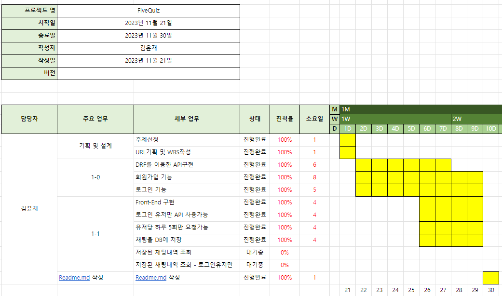
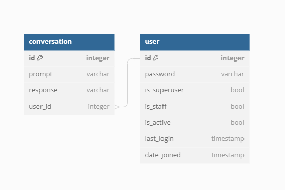
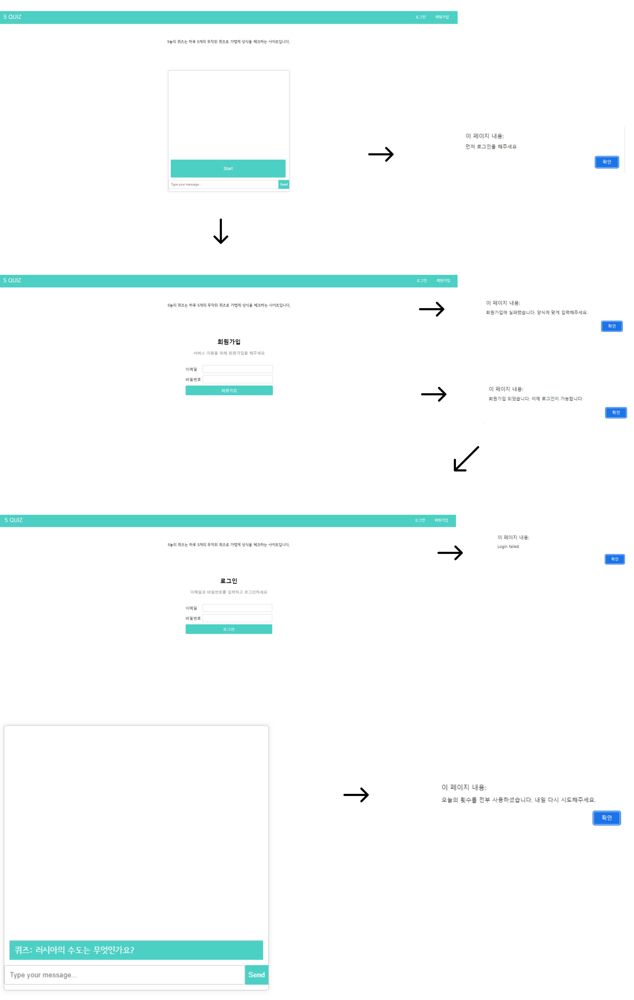

# 5늘의 퀴즈
- 5늘의 퀴즈는 하루 5개의 무작위 퀴즈로 가볍게 상식을 체크하는 사이트입니다.

## 1. 목표와 기능

### 1.1 목표
- 간단하게 ChatGPT를 이용하여 상식 퀴즈 풀기

### 1.2 기능
- 회원가입, 로그인, 로그아웃 기능
- 퀴즈 풀기 기능은 회원만이 가능
- 퀴즈 풀기 방식은 간단한 입력창에서 진행

## 2. 개발 환경 및 배포 URL
### 2.1 개발 환경

- 
- 
- 

- 
- 
- 

- 


### 2.3 URL 구조
- accounts

| App       | URL                                        | Views Function    | HTTP                | Note           |
|-----------|--------------------------------------------|-------------------|---------------------|----------------|
| accounts  | 'register/'                                | RegisterationView | POST                |회원가입         |
| accounts  | 'login/'                                   | LoginView         | POST                |로그인           |

- chat

| App       | URL                                        | Views Function    | HTTP                | Note           |
|-----------|--------------------------------------------|-------------------|---------------------|----------------|
| chat      | 'chat/'                                    | ChatbotView       | GET,POST            | 게시판 목록     |


## 3. 프로젝트 구조

📦FiveQuiz  
 ┣ 📂accounts  
 ┃ ┣ 📂__pycache__  
 ┃ ┣ 📂migrations  
 ┃ ┗ 📜__init__.py  
 ┃ ┣ 📜admin.py  
 ┃ ┣ 📜apps.py  
 ┃ ┣ 📜models.py  
 ┃ ┣ 📜serializers.py  
 ┃ ┣ 📜tests.py  
 ┃ ┣ 📜urls.py  
 ┃ ┣ 📜views.py  
 ┣ 📂chat  
 ┃ ┣ 📂__pycache__  
 ┃ ┣ 📂migrations  
 ┃ ┗ 📜__init__.py  
 ┃ ┣ 📜admin.py  
 ┃ ┣ 📜apps.py  
 ┃ ┣ 📜models.py  
 ┃ ┣ 📜tests.py  
 ┃ ┣ 📜throttling.py  
 ┃ ┣ 📜urls.py  
 ┃ ┣ 📜views.py  
 ┣ 📂config  
 ┃ ┣ 📂__pycache__  
 ┃ ┣ 📜__init__.py  
 ┃ ┣ 📜asgi.py  
 ┃ ┣ 📜settings.py  
 ┃ ┣ 📜urls.py  
 ┃ ┗ 📜wsgi.py  
 ┣ 📂static  
 ┣ 📜db.sqlite3  
 ┣ 📜manage.py  
 ┗ 📜requirements.txt  
📦FiveQuiz FE  
 ┣ 📂css  
 ┃ ┣ 📜login-join.css  
 ┃ ┗ 📜style.css  
 ┣ 📂js  
 ┃ ┣ 📜chat.js  
 ┃ ┣ 📜join.js  
 ┃ ┣ 📜login.js  
 ┃ ┣ 📜status.js  
 ┣ 📜chat.html  
 ┣ 📜index.html  
 ┣ 📜join.html  
 ┗ 📜login.html  

## 4 개발 일정(WBS)



## 5. 데이터베이스 모델링(ERD)



## 6. 와이어프레임 /UI 



## 7. 에러와 에러 해결
- 프론트엔드와 백엔드 연결?

부끄럽지만 이 둘을 연결하는 방식을 전혀 이해하지 못했다. Django가 기본으로 viewing을 제공하기에, 실습중에 했었던 서버단에서 html을 실행하는 방식에 익숙해진 것이 오히려 독이 된 케이스.
처음엔 Django 서버를 두 개 굴려야하나? 포트번호를 다르게 해서? 아님 외부툴을 사용해서? 같은 여러가지 시도. 검색해도 딱히 나오지 않았다.
Django서버를 Run하고, VScode Live 서버 익스텐션이나 브라우저를 실행하면 되는 간단한 문제였는데 이것을 몰라서 시간을 많이 소모.
모르는것은 자꾸 혼자 고민하는 습관이 있는데, 이를 고치도록 노력해야 겠다는 생각.

- 유저 커스터마이징

```python
def _create_user(self, email, password, is_superuser, **extra_fields)
```
create_super_user도 이메일과 비밀번호로만 가입되도록 편집하는 과정에서 에러가 나서 검색해봤는데, is_superuser와 is_active 속성이 없어서임을 알게됨.
이를 단순히 생각해서 함수 선언 자체에 넣어버려서 db에도 굳히 필요없는 속성이 추가되어버림.
에러가 되지 않는다고 넘어가지 말고, 좀 더 코드를 생각해봐야 하겠다는 깨달음.

- POST를 요청해도 OPTIONS가 간다?

GET이나 POST요청을 해도 OPTIONS 요청이 대신 가는 현상.

Content-Type이 application/json이고 사용자 임의로 헤더를 정의한 경우, preflighted request로 분류되어 POST요청을 전송하기 이전에 OPTIONS 요청을 먼저 보내서 사전검사를 수행하도록 정해져있기 때문: 보안이슈

django-cors-headers 와 settings.py에 CORS_ORIGIN_ALLOW_ALL=True 를 선언 함으로서 해결.

- Rate limits

```openai.error.RateLimitError: Rate limit reached for text-davinci-003 in organization org-fTXY4VhJ74Es1uwcePdPoZjG on requests per min (RPM): Limit 3, Used 3, Requested 1. Please try again in 20s```

리퀘스트가 너무 많이 요청되었다는 에러? wait()함수를 따로 만들어서 20초를 걸어버리면 어느정도 처리되긴 하나 근본적인 해결은 실패.
